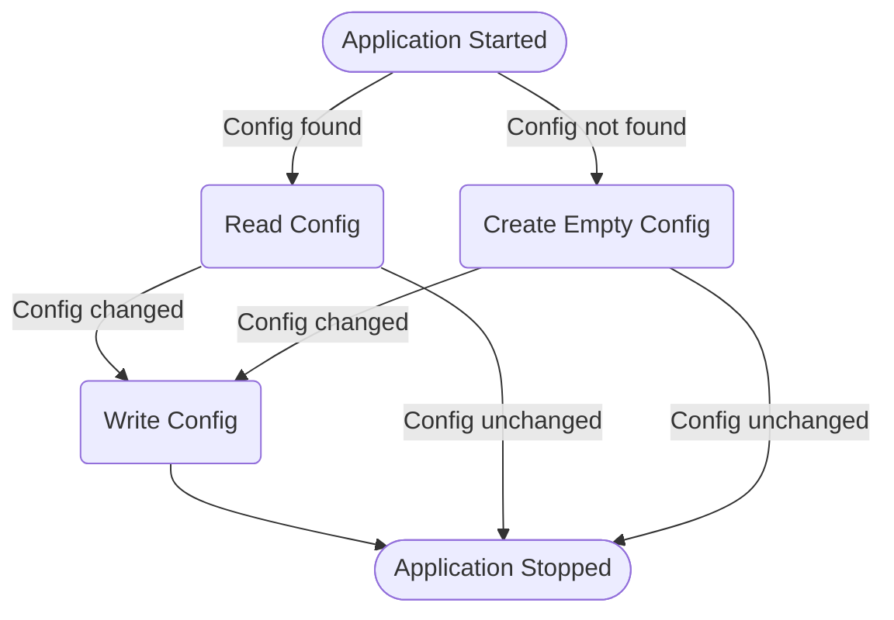

# YetAnotherMinecraftLauncher

## Config system anatomized

- `Round square` is for application lifetime
- `Square` is for user behavior and input
- `Round corner square` is for application response upon user behavior
